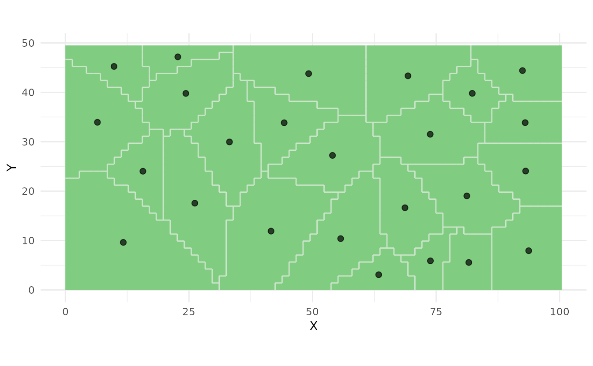
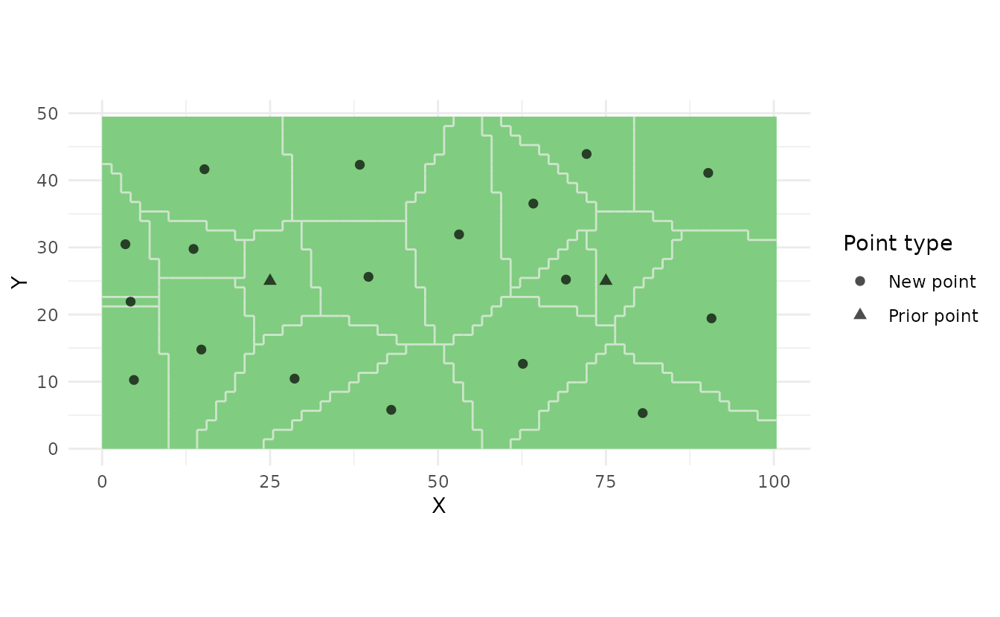
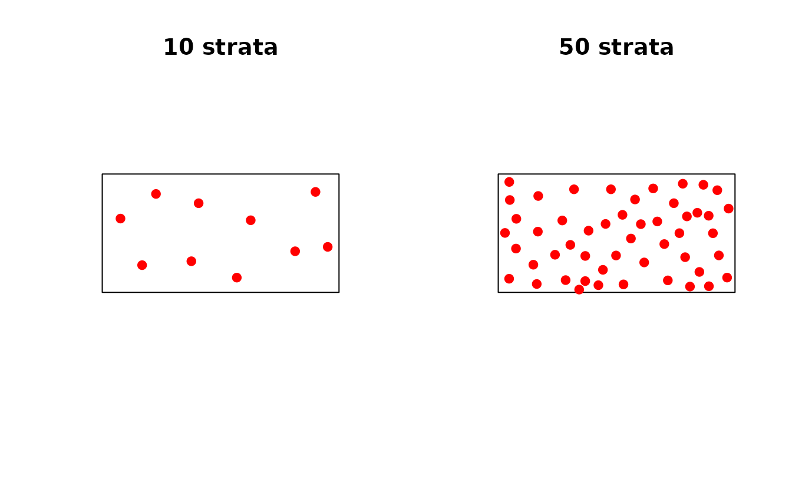
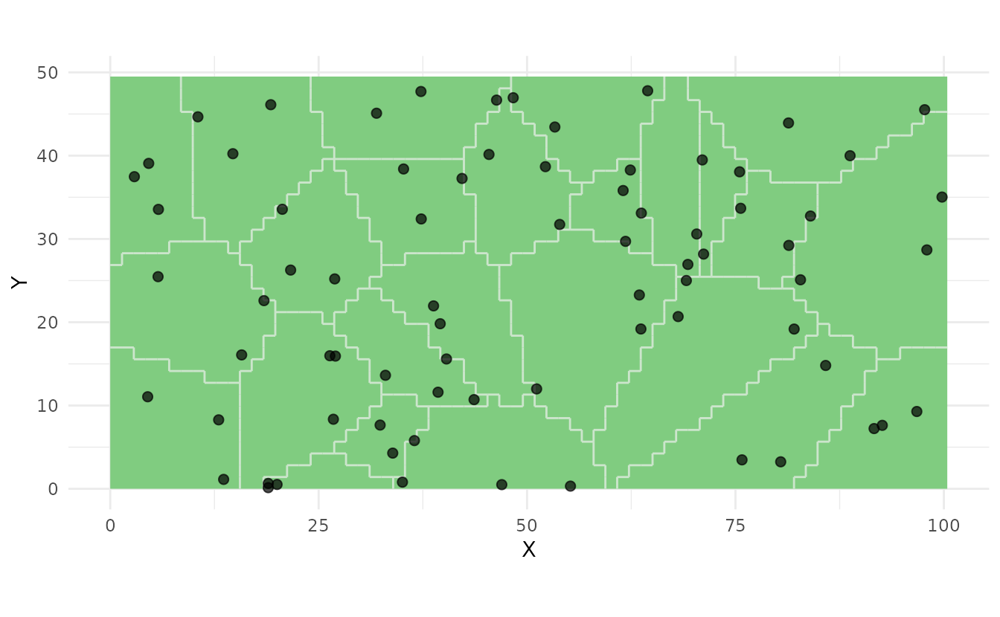
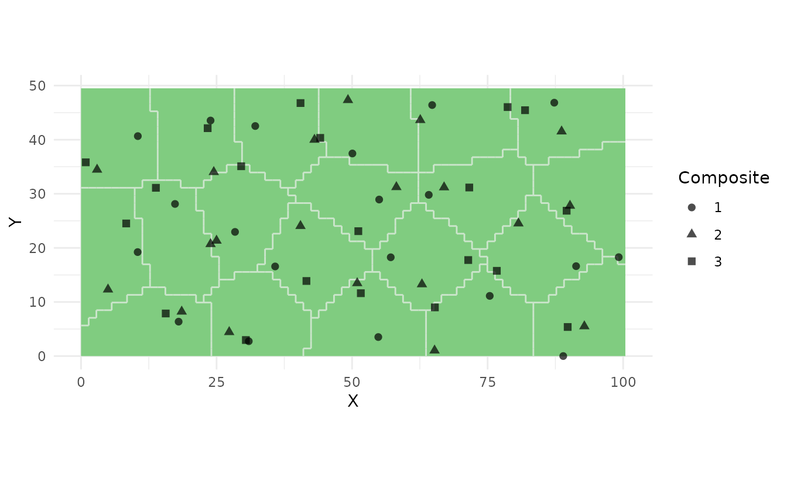
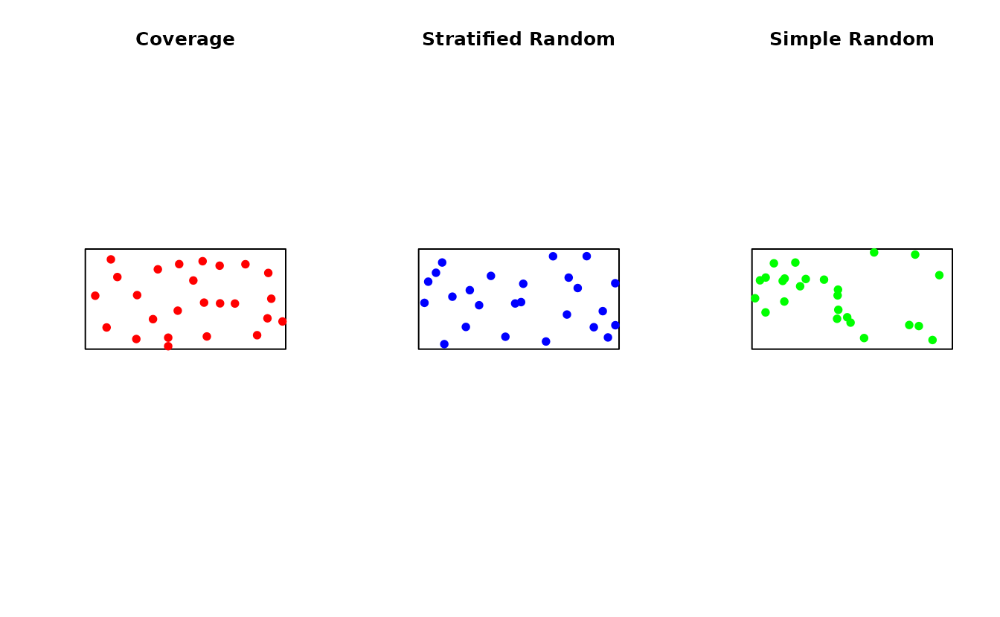

# Spatial Coverage Sampling Methods

## Introduction

Spatial coverage sampling aims to provide optimal spatial distribution
of sampling points across a study area. The **soilsampling** package
implements spatial coverage using k-means clustering to create compact
geographical strata, with samples placed at stratum centroids.

This approach is particularly effective for:

- **Model-based inference**: Kriging and spatial interpolation
- **Soil mapping**: Creating detailed soil maps
- **Environmental monitoring**: Capturing spatial variability
- **Resource assessment**: Estimating spatial distributions

## Theoretical Background

The spatial coverage method is based on:

1.  **K-means clustering** in geographic space to create compact strata
2.  **Stratification** that minimizes Mean Squared Shortest Distance
    (MSSD)
3.  **Centroid sampling** for optimal spatial coverage

The k-means algorithm partitions the study area into compact spatial
strata by minimizing:

$$\text{MSSD} = \frac{1}{m}\sum\limits_{i = 1}^{m}\min\limits_{k}d^{2}\left( x_{i},c_{k} \right)$$

where $x_{i}$ are grid cell centers, $c_{k}$ are stratum centroids, and
$d$ is Euclidean distance (or haversine distance for lat/lon
coordinates).

## Basic Usage

``` r
library(soilsampling)
library(sf)

# Create a study area
poly <- st_polygon(list(rbind(
  c(0, 0), c(100, 0), c(100, 50), c(0, 50), c(0, 0)
)))
study_area <- st_sf(geometry = st_sfc(poly))

# Set seed for reproducibility
set.seed(123)
```

### Direct Coverage Sampling

``` r
# Create 25 coverage samples in one step
samples <- ss_coverage(study_area, n_strata = 25, n_try = 5)

print(samples)
#> Spatial Coverage Sampling 
#> ========================= 
#> Number of samples: 25 
#> Number of strata: 25
```

### Two-Step Approach

``` r
# Step 1: Create stratification
strata <- ss_stratify(study_area, n_strata = 25, n_try = 5)

print(strata)
#> Soil Sampling Stratification
#> ============================
#> Number of strata: 25 
#> Number of cells: 2485 
#> Cell size: 1.41 x 1.41 
#> MSSD: 42.7747 
#> Converged: TRUE 
#> Equal area: FALSE

# Step 2: Extract centroids as sampling points
samples <- ss_coverage(strata)

# Plot both strata and samples
ss_plot(strata, samples = samples)
```



## Algorithm Variants

The package implements two k-means variants:

### 1. Transfer Algorithm (Default)

Creates compact strata that may have unequal sizes:

``` r
# Standard spatial coverage
samples_transfer <- ss_coverage(study_area, n_strata = 20, n_try = 5)

# Check stratum sizes
strata_transfer <- ss_stratify(study_area, n_strata = 20, n_try = 5)
areas <- ss_relative_area(strata_transfer)
summary(areas)
#>    Min. 1st Qu.  Median    Mean 3rd Qu.    Max. 
#> 0.01730 0.02897 0.04547 0.05000 0.06539 0.09819
```

### 2. Swop Algorithm (Equal Area)

Creates strata of approximately equal size:

``` r
# Equal-area coverage sampling
samples_equal <- ss_coverage_equal_area(study_area, n_strata = 20, n_try = 5)

# Check stratum sizes
strata_equal <- ss_stratify(
  study_area,
  n_strata = 20,
  n_try = 5,
  equal_area = TRUE
)
areas_equal <- ss_relative_area(strata_equal)
summary(areas_equal)
#>    Min. 1st Qu.  Median    Mean 3rd Qu.    Max. 
#>  0.0499  0.0499  0.0499  0.0500  0.0500  0.0503
```

The equal-area variant is particularly useful for composite sampling
where you need equal representation from each stratum.

## Incorporating Prior Points

You can incorporate existing sampling locations as fixed stratum
centers:

``` r
# Suppose we have 2 existing sampling locations
prior_pts <- st_as_sf(
  data.frame(x = c(25, 75), y = c(25, 25)),
  coords = c("x", "y")
)

# Create stratification with prior points
strata_prior <- ss_stratify(
  study_area,
  n_strata = 20,
  prior_points = prior_pts,
  n_try = 5
)

# Get coverage samples
samples_prior <- ss_coverage(strata_prior)

# Plot with prior points highlighted
ss_plot(samples_prior)
```



Prior points are useful when: - Adding to an existing monitoring
network - Incorporating legacy sampling locations - Designing adaptive
sampling schemes

## Optimizing Parameters

### Number of Strata

The choice of `n_strata` depends on:

- **Survey budget**: More strata = more samples
- **Spatial variability**: More heterogeneous areas need more samples
- **Mapping resolution**: Finer maps need more samples

``` r
# Compare different numbers of strata
samples_10 <- ss_coverage(study_area, n_strata = 10, n_try = 5)
samples_50 <- ss_coverage(study_area, n_strata = 50, n_try = 5)

par(mfrow = c(1, 2))
plot(st_geometry(study_area), main = "10 strata")
plot(st_geometry(samples_10$samples), add = TRUE, pch = 19, col = "red")

plot(st_geometry(study_area), main = "50 strata")
plot(st_geometry(samples_50$samples), add = TRUE, pch = 19, col = "red")
```



``` r
par(mfrow = c(1, 1))
```

### Number of Tries

The `n_try` parameter controls how many random initializations to use:

``` r
# Compare convergence with different n_try values
set.seed(456)
result_1 <- ss_stratify(study_area, n_strata = 25, n_try = 1)
result_5 <- ss_stratify(study_area, n_strata = 25, n_try = 5)
result_20 <- ss_stratify(study_area, n_strata = 25, n_try = 20)

cat("n_try = 1:  MSSD =", format(result_1$mssd, digits = 6), "\n")
#> n_try = 1:  MSSD = 44.7988
cat("n_try = 5:  MSSD =", format(result_5$mssd, digits = 6), "\n")
#> n_try = 5:  MSSD = 42.2537
cat("n_try = 20: MSSD =", format(result_20$mssd, digits = 6), "\n")
#> n_try = 20: MSSD = 40.4673
```

Higher `n_try` generally produces better results but takes longer.

### Grid Resolution

Control discretization resolution with `n_cells` or `cell_size`:

``` r
# Coarse grid (fast)
strata_coarse <- ss_stratify(
  study_area,
  n_strata = 25,
  n_cells = 500,
  n_try = 3
)

# Fine grid (slower but more precise)
strata_fine <- ss_stratify(
  study_area,
  n_strata = 25,
  n_cells = 5000,
  n_try = 3
)

cat("Coarse grid:", nrow(strata_coarse$cells), "cells\n")
#> Coarse grid: 512 cells
cat("Fine grid:  ", nrow(strata_fine$cells), "cells\n")
#> Fine grid:   5000 cells
```

## Stratified Random Sampling

For design-based inference, use stratified random sampling instead of
centroid placement:

``` r
# Create strata
strata <- ss_stratify(study_area, n_strata = 25, n_try = 5)

# Take 1 random sample per stratum
samples_strat <- ss_stratified(strata, n_per_stratum = 1)

# Or take multiple samples per stratum
samples_strat_3 <- ss_stratified(strata, n_per_stratum = 3)

ss_plot(strata, samples = samples_strat_3)
```



This provides: - Valid probability sampling - Unbiased estimates of
means and totals - Better precision than simple random sampling

## Composite Sampling

For laboratory cost reduction, combine samples from multiple locations:

``` r
# Create 3 composite samples from 20 equal-area strata
samples_comp <- ss_composite(study_area, n_strata = 20, n_composites = 3)

# Each composite includes one sample from each stratum
ss_plot(samples_comp)
```



## Working with Geographic Coordinates

The package handles lat/lon coordinates automatically:

``` r
# Study area with geographic CRS
study_area_geo <- st_transform(study_area, crs = 4326)

# The algorithm uses haversine distance automatically
samples_geo <- ss_coverage(study_area_geo, n_strata = 25, n_try = 5)

# Note: equal_area is not supported for lat/lon
# This will produce an error:
# samples_error <- ss_coverage_equal_area(study_area_geo, n_strata = 25)
```

## Practical Workflow

A typical workflow for a soil survey:

``` r
# 1. Load study area
study_area <- st_read("my_field.shp")

# 2. Design sampling scheme
set.seed(42)  # For reproducibility
samples <- ss_coverage(study_area, n_strata = 50, n_try = 10)

# 3. Examine results
print(samples)
summary(samples)

# 4. Export for field work
coords <- ss_to_data_frame(samples)
write.csv(coords, "field_sampling_locations.csv", row.names = FALSE)

# 5. Export as shapefile for GPS
st_write(ss_to_sf(samples), "sampling_points.gpkg")
```

## Comparison with Other Methods

``` r
set.seed(789)

# Spatial coverage
samp_coverage <- ss_coverage(study_area, n_strata = 25, n_try = 5)

# Stratified random
strata <- ss_stratify(study_area, n_strata = 25, n_try = 5)
samp_stratified <- ss_stratified(strata, n_per_stratum = 1)

# Simple random
samp_random <- ss_random(study_area, n = 25)

# Compare spatial distribution
par(mfrow = c(1, 3))

plot(st_geometry(study_area), main = "Coverage")
plot(st_geometry(samp_coverage$samples), add = TRUE, pch = 19, col = "red")

plot(st_geometry(study_area), main = "Stratified Random")
plot(st_geometry(samp_stratified$samples), add = TRUE, pch = 19, col = "blue")

plot(st_geometry(study_area), main = "Simple Random")
plot(st_geometry(samp_random$samples), add = TRUE, pch = 19, col = "green")
```



``` r

par(mfrow = c(1, 1))
```

## References

- Walvoort, D.J.J., Brus, D.J., and de Gruijter, J.J. (2010). An R
  package for spatial coverage sampling and random sampling from compact
  geographical strata by k-means. *Computers & Geosciences* 36,
  1261-1267. DOI: 10.1016/j.cageo.2010.04.005

- de Gruijter, J.J., Brus, D.J., Bierkens, M.F.P., and Knotters, M.
  (2006). *Sampling for Natural Resource Monitoring*. Springer, Berlin.

- Brus, D.J. and de Gruijter, J.J. (1997). Random sampling or
  geostatistical modelling? Choosing between design-based and
  model-based sampling strategies for soil. *Geoderma* 80(1-2), 1-44.
