# Complete User Guide for soilsampling Package

## Introduction

The **soilsampling** package provides comprehensive tools for designing
soil sampling schemes in R. This guide demonstrates all available
functions with practical code examples.

### Installation

``` r
# Install from local source
install.packages("soilsampling", repos = NULL, type = "source")

# Or using devtools
devtools::install_local("path/to/soilsampling")
```

### Load Package

``` r
library(soilsampling)
library(sf)
#> Linking to GEOS 3.12.1, GDAL 3.8.4, PROJ 9.4.0; sf_use_s2() is TRUE

# Set seed for reproducibility
set.seed(42)
```

### Create Study Area

For all examples, we’ll use a simple rectangular study area:

``` r
# Create a polygon
poly <- st_polygon(list(rbind(
  c(0, 0), c(100, 0), c(100, 50), c(0, 50), c(0, 0)
)))

# Create sf object
study_area <- st_sf(geometry = st_sfc(poly))
```

------------------------------------------------------------------------

## 1. Stratification Functions

### 1.1 `ss_stratify()` - Create Compact Strata

Creates compact geographical strata using k-means clustering.

**Basic Usage:**

``` r
# Create 25 compact strata
strata <- ss_stratify(study_area, n_strata = 25, n_try = 5)

# View structure
print(strata)
#> Soil Sampling Stratification
#> ============================
#> Number of strata: 25 
#> Number of cells: 2485 
#> Cell size: 1.41 x 1.41 
#> MSSD: 42.0403 
#> Converged: TRUE 
#> Equal area: FALSE
```

**With Equal-Area Strata:**

``` r
# Create 20 equal-area strata
strata_equal <- ss_stratify(
  study_area,
  n_strata = 20,
  equal_area = TRUE,
  n_try = 5
)
```

**With Prior Points:**

``` r
# Existing sample locations
prior_pts <- st_as_sf(
  data.frame(x = c(25, 75), y = c(25, 25)),
  coords = c("x", "y")
)

# Create stratification around prior points
strata_prior <- ss_stratify(
  study_area,
  n_strata = 20,
  prior_points = prior_pts,
  n_try = 5
)
```

**Advanced Parameters:**

``` r
# Fine-tune stratification
strata_custom <- ss_stratify(
  study_area,
  n_strata = 30,
  n_cells = 2500,      # Higher resolution grid
  n_try = 10,          # More attempts to find optimal
  equal_area = FALSE,
  verbose = TRUE
)
#> 2025-12-24 03:04:28 | Optimizing configuration 1
#>     Current MSSD: 33.7103
#>     Best MSSD: 33.7103
#> 2025-12-24 03:04:28 | Optimizing configuration 2
#>     Current MSSD: 36.4875
#>     Best MSSD: 33.7103
#> 2025-12-24 03:04:28 | Optimizing configuration 3
#>     Current MSSD: 34.0026
#>     Best MSSD: 33.7103
#> 2025-12-24 03:04:28 | Optimizing configuration 4
#>     Current MSSD: 37.1821
#>     Best MSSD: 33.7103
#> 2025-12-24 03:04:28 | Optimizing configuration 5
#>     Current MSSD: 35.1059
#>     Best MSSD: 33.7103
#> 2025-12-24 03:04:29 | Optimizing configuration 6
#>     Current MSSD: 41.1071
#>     Best MSSD: 33.7103
#> 2025-12-24 03:04:29 | Optimizing configuration 7
#>     Current MSSD: 40.3993
#>     Best MSSD: 33.7103
#> 2025-12-24 03:04:29 | Optimizing configuration 8
#>     Current MSSD: 35.2979
#>     Best MSSD: 33.7103
#> 2025-12-24 03:04:29 | Optimizing configuration 9
#>     Current MSSD: 36.664
#>     Best MSSD: 33.7103
#> 2025-12-24 03:04:29 | Optimizing configuration 10
#>     Current MSSD: 42.7942
#>     Best MSSD: 33.7103
```

------------------------------------------------------------------------

## 2. Sampling Functions

### 2.1 `ss_random()` - Simple Random Sampling

Generates random sampling points uniformly distributed across the study
area.

**Basic Usage:**

``` r
# Select 30 random points
samples_random <- ss_random(study_area, n = 30)
print(samples_random)
#> Simple Random Sampling 
#> ====================== 
#> Number of samples: 30
```

**With Seed for Reproducibility:**

``` r
# Reproducible random sampling
samples_random_rep <- ss_random(study_area, n = 25, seed = 123)
```

------------------------------------------------------------------------

### 2.2 `ss_stratified()` - Stratified Random Sampling

Random sampling within each stratum.

**Basic Usage:**

``` r
# Create strata first
strata <- ss_stratify(study_area, n_strata = 25, n_try = 5)

# Sample 1 point per stratum
samples_strat <- ss_stratified(strata, n_per_stratum = 1)
print(samples_strat)
#> Stratified Random Sampling 
#> ========================== 
#> Number of samples: 25 
#> Number of strata: 25 
#> Samples per stratum: 1
```

**Multiple Points per Stratum:**

``` r
# Sample 2 points per stratum
samples_strat2 <- ss_stratified(strata, n_per_stratum = 2, seed = 456)
```

**With Different Seed:**

``` r
# Different random realization
samples_strat3 <- ss_stratified(strata, n_per_stratum = 1, seed = 789)
```

------------------------------------------------------------------------

### 2.3 `ss_coverage()` - Spatial Coverage Sampling

Purposive sampling at stratum centroids for optimal spatial coverage.

**From Strata Object:**

``` r
# Use pre-computed strata
strata <- ss_stratify(study_area, n_strata = 25, n_try = 5)
samples_cov <- ss_coverage(strata)
print(samples_cov)
#> Spatial Coverage Sampling 
#> ========================= 
#> Number of samples: 25 
#> Number of strata: 25
```

**Direct Approach:**

``` r
# All-in-one: stratify and sample
samples_cov_direct <- ss_coverage(
  study_area,
  n_strata = 20,
  n_try = 5
)
```

**With Prior Points:**

``` r
# Prior points marked differently
prior_pts <- st_as_sf(
  data.frame(x = c(50), y = c(25)),
  coords = c("x", "y")
)

strata_prior <- ss_stratify(
  study_area,
  n_strata = 24,
  prior_points = prior_pts,
  n_try = 5
)

samples_prior <- ss_coverage(strata_prior)
```

------------------------------------------------------------------------

### 2.4 `ss_coverage_equal_area()` - Equal-Area Coverage Sampling

Coverage sampling with strata of equal size.

**Basic Usage:**

``` r
# Create 25 equal-area strata and sample
samples_eq <- ss_coverage_equal_area(
  study_area,
  n_strata = 25,
  n_try = 5
)
print(samples_eq)
#> Spatial Coverage Sampling (Equal Area) 
#> ====================================== 
#> Number of samples: 25 
#> Number of strata: 25
```

**Custom Parameters:**

``` r
# Fine-tuned equal-area sampling
samples_eq_custom <- ss_coverage_equal_area(
  study_area,
  n_strata = 30,
  n_cells = 3000,
  n_try = 10
)
```

------------------------------------------------------------------------

### 2.5 `ss_maxvol()` - Maxvol Optimal Design Sampling

Feature-based sampling using D-optimal experimental design.

**With sf Object and Features:**

``` r
# Create grid with features
strata <- ss_stratify(study_area, n_strata = 100, n_try = 3)
cells_sf <- strata$cells

# Add terrain-like features
coords <- st_coordinates(cells_sf)
cells_sf$elevation <- coords[,2] + rnorm(nrow(coords), 0, 5)
cells_sf$slope <- abs(rnorm(nrow(coords), 5, 2))
cells_sf$twi <- rnorm(nrow(coords), 8, 1.5)

# Select optimal samples based on features
samples_maxvol <- ss_maxvol(
  cells_sf,
  n = 20,
  features = c("elevation", "slope", "twi"),
  normalize = TRUE,
  add_coords = TRUE
)
print(samples_maxvol)
#> NA 
#> NA 
#> Number of samples: 20
```

**With Feature Matrix:**

``` r
# Custom feature matrix
n_loc <- 100
feature_mat <- matrix(
  c(
    rnorm(n_loc, 100, 10),   # elevation
    abs(rnorm(n_loc, 5, 2)),  # slope
    rnorm(n_loc, 8, 1.5)      # TWI
  ),
  ncol = 3
)
colnames(feature_mat) <- c("elevation", "slope", "twi")

coords_mat <- cbind(
  x = runif(n_loc, 0, 100),
  y = runif(n_loc, 0, 50)
)

samples_maxvol_mat <- ss_maxvol(
  feature_mat,
  n = 15,
  coords = coords_mat,
  normalize = TRUE,
  seed = 789
)
```

**With Minimum Distance Constraint:**

``` r
# Prevent spatial clustering
samples_maxvol_dist <- ss_maxvol(
  cells_sf,
  n = 15,
  features = c("elevation", "slope", "twi"),
  min_dist = 8,        # Minimum 8 units between samples
  normalize = TRUE,
  add_coords = TRUE
)
```

**Advanced Options:**

``` r
# Fine-tune maxvol algorithm
samples_maxvol_adv <- ss_maxvol(
  cells_sf,
  n = 25,
  features = c("elevation", "slope"),
  min_dist = 5,
  normalize = TRUE,
  add_coords = FALSE,   # Don't include coordinates
  tol = 1.2,            # Convergence tolerance
  max_iters = 200,      # Maximum iterations
  verbose = TRUE,
  seed = 999
)
#> Normalized features
#> Running maxvol algorithm...
#> Maxvol converged in 1 iterations
```

------------------------------------------------------------------------

### 2.6 `ss_composite()` - Composite Sampling

Sampling for combining samples from multiple locations.

**Basic Usage:**

``` r
# Create 3 composite samples from 20 strata
samples_comp <- ss_composite(
  study_area,
  n_strata = 20,
  n_composites = 3
)
print(samples_comp)
#> Composite Sampling 
#> ================== 
#> Number of samples: 60 
#> Number of strata: 20 
#> Number of composites: 3 
#> Samples per stratum: 3
```

**More Composites:**

``` r
# Create 5 composite samples
samples_comp5 <- ss_composite(
  study_area,
  n_strata = 30,
  n_composites = 5,
  n_try = 10
)
```

------------------------------------------------------------------------

## 3. Visualization Functions

### 3.1 `ss_plot()` - Plot Strata and/or Samples

Main plotting function for stratification and samples.

**Plot Strata Only:**

``` r
strata <- ss_stratify(study_area, n_strata = 25, n_try = 5)
ss_plot(strata)
```

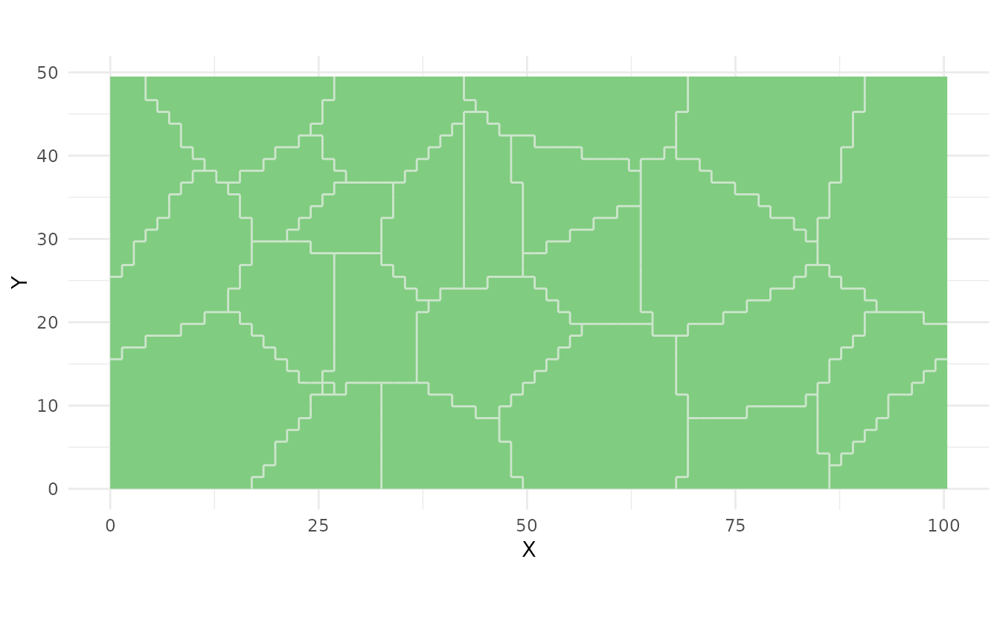

**Plot Strata with Samples:**

``` r
samples <- ss_stratified(strata, n_per_stratum = 1)
ss_plot(strata, samples = samples)
```

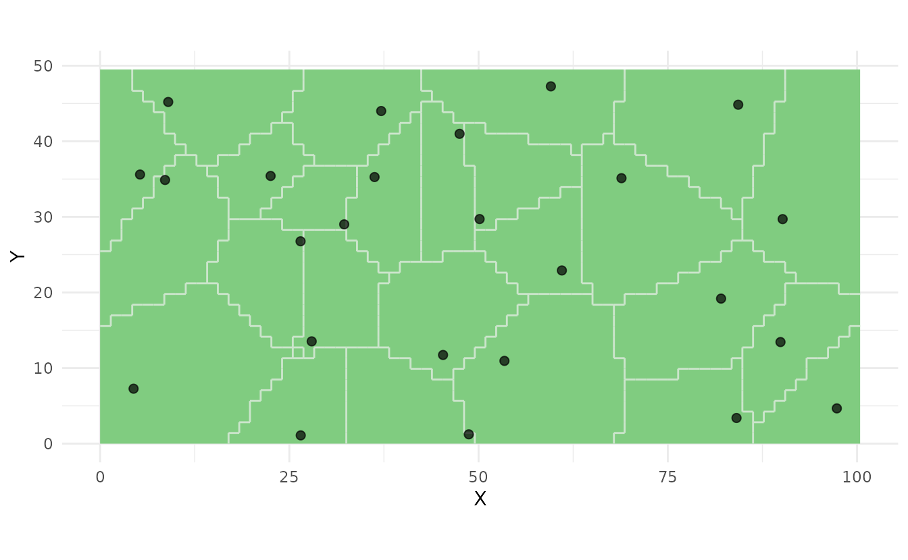

**Plot with Prior Points:**

``` r
prior_pts <- st_as_sf(
  data.frame(x = c(25, 75), y = c(25, 25)),
  coords = c("x", "y")
)

strata_prior <- ss_stratify(
  study_area,
  n_strata = 23,
  prior_points = prior_pts,
  n_try = 5
)

samples_prior <- ss_coverage(strata_prior)
ss_plot(strata_prior, samples = samples_prior)
```


------------------------------------------------------------------------

### 3.2 `ss_plot_samples()` - Plot Samples Only

Plot sampling points without stratification.

**Basic Usage:**

``` r
samples <- ss_random(study_area, n = 30)
ss_plot_samples(samples)
```

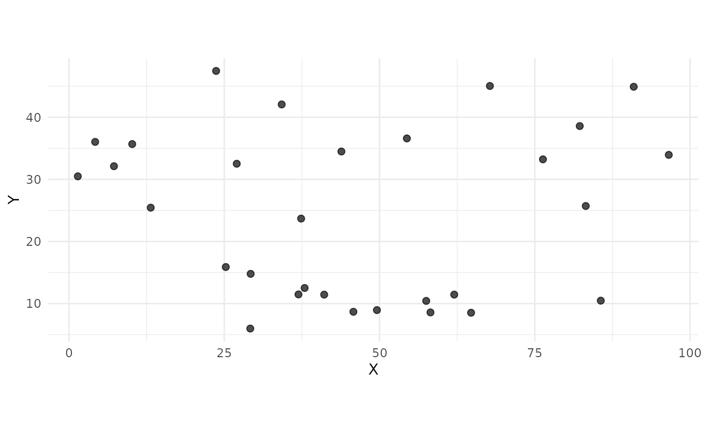

**Composite Samples:**

``` r
samples_comp <- ss_composite(study_area, n_strata = 20, n_composites = 3)
ss_plot_samples(samples_comp)
```

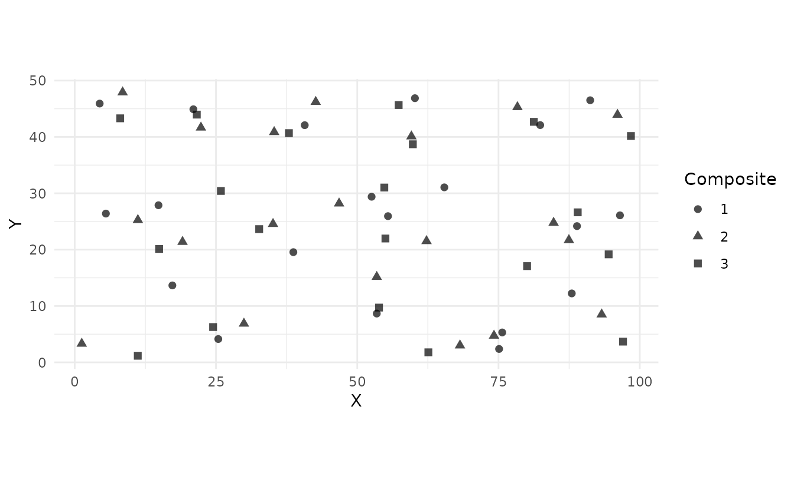

------------------------------------------------------------------------

### 3.3 `plot()` - S3 Plot Methods

Generic plot methods for ss_strata and ss_samples objects.

**Plot Strata:**

``` r
strata <- ss_stratify(study_area, n_strata = 20, n_try = 5)
plot(strata)
```

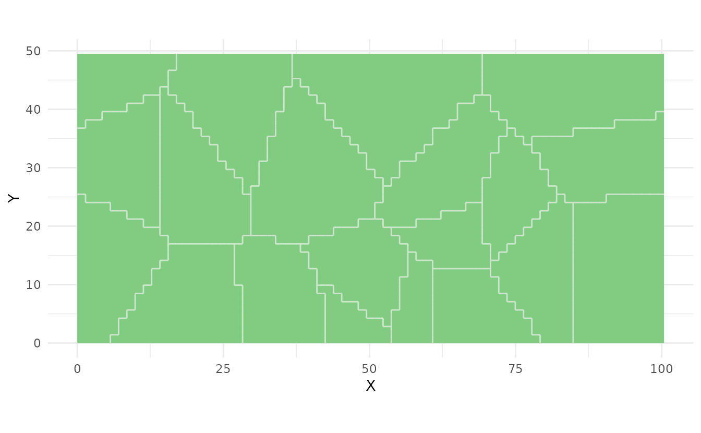

**Plot Samples:**

``` r
samples <- ss_coverage(study_area, n_strata = 25, n_try = 5)
plot(samples)
```

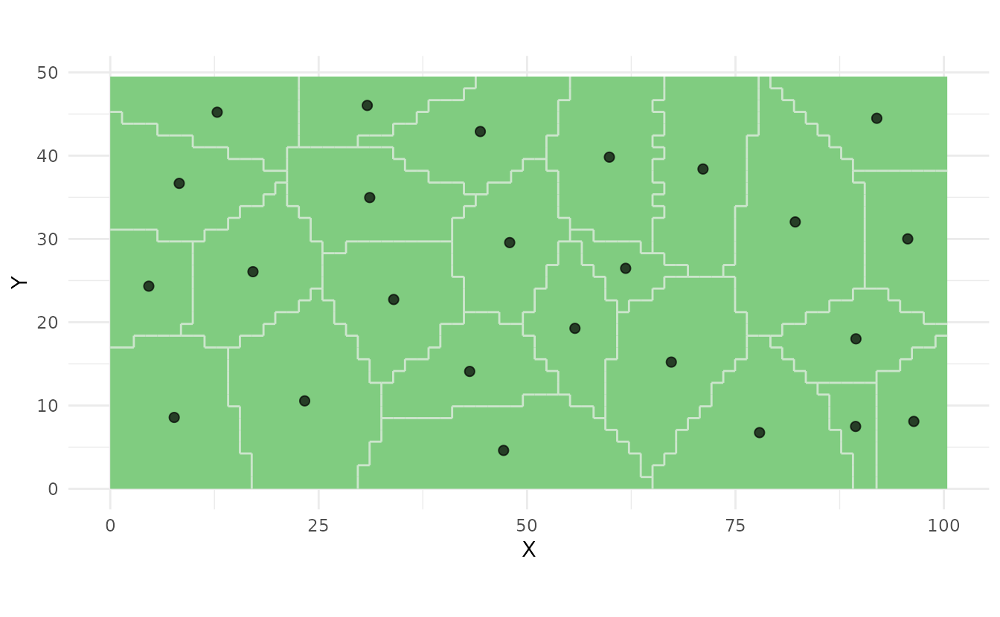

------------------------------------------------------------------------

## 4. Summary and Information Functions

### 4.1 `ss_summary()` - Get Summary Statistics

Comprehensive summary of stratification or sampling results.

**For Strata:**

``` r
strata <- ss_stratify(study_area, n_strata = 25, n_try = 5)
summary(strata)
#> Soil Sampling Stratification Summary
#> =====================================
#> 
#> Strata:
#>   Number of strata: 25 
#>   Total cells: 2485 
#>   Cells per stratum (mean): 99.4 
#>   Cells per stratum (range): 31 - 193 
#> 
#> Algorithm:
#>   Equal area: FALSE 
#>   Converged: TRUE 
#>   MSSD: 39.6099 
#> 
#> Area:
#>   Cell size: 1.41 x 1.41 
#>   Total area: 4970
```

**For Samples:**

``` r
samples <- ss_coverage(strata)
summary_samples <- ss_summary(samples)
print(summary_samples)
#>     method n_samples    x_min    x_max    y_min    y_max n_strata     mssd
#> 1 coverage        25 3.760522 95.12796 3.307435 46.57349       25 39.60994
#>   equal_area
#> 1      FALSE
```

------------------------------------------------------------------------

### 4.2 `ss_summary.maxvol()` - Maxvol Summary

Special summary for maxvol sampling results.

``` r
# Create grid with features
strata <- ss_stratify(study_area, n_strata = 100, n_try = 3)
cells_sf <- strata$cells
coords <- st_coordinates(cells_sf)
cells_sf$elevation <- coords[,2] + rnorm(nrow(coords), 0, 5)
cells_sf$slope <- abs(rnorm(nrow(coords), 5, 2))

samples_maxvol <- ss_maxvol(
  cells_sf,
  n = 20,
  features = c("elevation", "slope"),
  normalize = TRUE
)

# Get maxvol-specific summary
summary_maxvol <- ss_summary.maxvol(samples_maxvol)
#> Maxvol Optimal Design Sampling - Summary
#> =========================================
#> 
#> Samples:
#>   Total samples: 20 
#>   X range: 0.71 - 26.16 
#>   Y range: 0.71 - 44.55 
#> 
#> Maxvol Algorithm:
#>   Features used: 4 
#>   Feature names: elevation, slope, X, Y 
#>   Converged: TRUE 
#>   Iterations: 2
print(summary_maxvol)
#> NA 
#> NA 
#> Number of samples: 20
```

------------------------------------------------------------------------

### 4.3 `print()` - Print Objects

**Print Strata:**

``` r
strata <- ss_stratify(study_area, n_strata = 20, n_try = 5)
print(strata)
#> Soil Sampling Stratification
#> ============================
#> Number of strata: 20 
#> Number of cells: 2485 
#> Cell size: 1.41 x 1.41 
#> MSSD: 52.6047 
#> Converged: TRUE 
#> Equal area: FALSE
```

**Print Samples:**

``` r
samples <- ss_random(study_area, n = 25)
print(samples)
#> Simple Random Sampling 
#> ====================== 
#> Number of samples: 25
```

------------------------------------------------------------------------

### 4.4 `summary()` - Generic Summary

**Summary of Strata:**

``` r
strata <- ss_stratify(study_area, n_strata = 25, n_try = 5)
summary(strata)
#> Soil Sampling Stratification Summary
#> =====================================
#> 
#> Strata:
#>   Number of strata: 25 
#>   Total cells: 2485 
#>   Cells per stratum (mean): 99.4 
#>   Cells per stratum (range): 27 - 170 
#> 
#> Algorithm:
#>   Equal area: FALSE 
#>   Converged: TRUE 
#>   MSSD: 40.4696 
#> 
#> Area:
#>   Cell size: 1.41 x 1.41 
#>   Total area: 4970
```

**Summary of Samples:**

``` r
samples <- ss_coverage(strata)
summary(samples)
#> Spatial Coverage Sampling  - Summary
#> =================================== 
#> 
#> Samples:
#>   Total samples: 25 
#>   X range: 4.12 - 95.53 
#>   Y range: 4.14 - 44.85 
#> 
#> Stratification:
#>   Number of strata: 25 
#>   Equal area: FALSE 
#>   MSSD: 40.4696
```

------------------------------------------------------------------------

## 5. Utility Functions

### 5.1 `ss_n_strata()` - Get Number of Strata

``` r
strata <- ss_stratify(study_area, n_strata = 25, n_try = 5)
n_strata <- ss_n_strata(strata)
print(n_strata)
#> [1] 25
```

------------------------------------------------------------------------

### 5.2 `ss_n_samples()` - Get Number of Samples

``` r
samples <- ss_random(study_area, n = 30)
n_samples <- ss_n_samples(samples)
print(n_samples)
#> [1] 30
```

------------------------------------------------------------------------

### 5.3 `ss_get_samples()` - Extract Samples as sf Object

``` r
samples <- ss_coverage(study_area, n_strata = 20, n_try = 5)
samples_sf <- ss_get_samples(samples)
head(samples_sf)
#> Simple feature collection with 6 features and 3 fields
#> Geometry type: POINT
#> Dimension:     XY
#> Bounding box:  xmin: 11.13327 ymin: 8.278927 xmax: 51.83682 ymax: 41.51285
#> CRS:           NA
#>   sample_id stratum_id is_prior                  geometry
#> 1         1          1    FALSE POINT (37.16239 24.66074)
#> 2         2          2    FALSE  POINT (45.3529 41.51285)
#> 3         3          3    FALSE POINT (51.83682 11.90296)
#> 4         4          4    FALSE POINT (22.81176 8.278927)
#> 5         5          5    FALSE  POINT (11.13327 16.8584)
#> 6         6          6    FALSE POINT (11.90231 37.75318)
```

------------------------------------------------------------------------

### 5.4 `ss_to_sf()` - Convert to sf Object

``` r
samples <- ss_random(study_area, n = 25)
samples_sf <- ss_to_sf(samples)
class(samples_sf)
#> [1] "sf"         "data.frame"
head(samples_sf)
#> Simple feature collection with 6 features and 1 field
#> Geometry type: POINT
#> Dimension:     XY
#> Bounding box:  xmin: 11.2348 ymin: 0.2503823 xmax: 54.97829 ymax: 35.30538
#> CRS:           NA
#>   sample_id                   geometry
#> 1         1 POINT (43.70442 0.2503823)
#> 2         2  POINT (54.97829 30.98729)
#> 3         3   POINT (11.2348 35.30538)
#> 4         4  POINT (16.84822 25.71406)
#> 5         5  POINT (35.64097 5.585776)
#> 6         6   POINT (19.2194 19.65943)
```

------------------------------------------------------------------------

### 5.5 `ss_to_data_frame()` - Convert to Data Frame

Extract coordinates and attributes as a data frame.

``` r
samples <- ss_coverage(study_area, n_strata = 20, n_try = 5)
coords_df <- ss_to_data_frame(samples)
head(coords_df)
#>   sample_id stratum_id is_prior        X        Y
#> 1         1          1    FALSE 84.23966 34.35649
#> 2         2          2    FALSE 13.51237 36.95738
#> 3         3          3    FALSE 10.85043 12.83033
#> 4         4          4    FALSE 27.93978 16.87991
#> 5         5          5    FALSE 93.03009 10.02530
#> 6         6          6    FALSE 30.85343 43.62849
```

------------------------------------------------------------------------

### 5.6 `ss_area()` - Get Stratum Areas

``` r
strata <- ss_stratify(study_area, n_strata = 25, n_try = 5)
areas <- ss_area(strata)
head(areas)
#>   1   2   3   4   5   6 
#> 348 266 194 182 270  98
```

------------------------------------------------------------------------

### 5.7 `ss_relative_area()` - Get Relative Stratum Areas

``` r
strata <- ss_stratify(study_area, n_strata = 25, n_try = 5)
rel_areas <- ss_relative_area(strata)
head(rel_areas)
#>          1          2          3          4          5          6 
#> 0.02535211 0.03259557 0.03460765 0.04507042 0.03098592 0.03420523
sum(rel_areas)  # Should sum to 1
#> [1] 1
```

------------------------------------------------------------------------

## 6. Complete Workflows

### 6.1 Workflow 1: Simple Random Sampling

``` r
# 1. Create study area
study_area <- st_sf(geometry = st_sfc(
  st_polygon(list(rbind(
    c(0, 0), c(100, 0), c(100, 50), c(0, 50), c(0, 0)
  )))
))

# 2. Generate random samples
set.seed(42)
samples <- ss_random(study_area, n = 30)

# 3. Visualize
ss_plot_samples(samples)
```

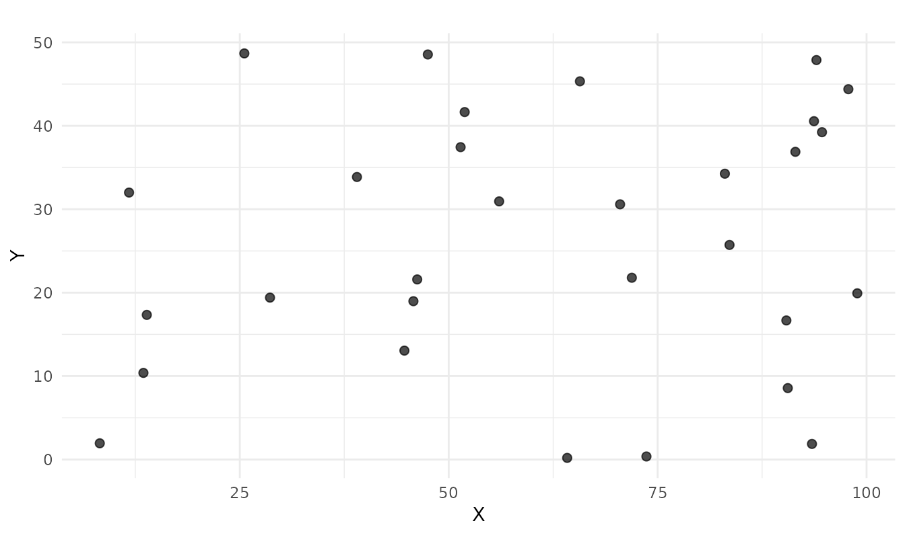

``` r

# 4. Export coordinates
coords <- ss_to_data_frame(samples)
head(coords)
#>   sample_id        X          Y
#> 1         1 91.48060 36.8797809
#> 2         2 93.70754 40.5527571
#> 3         3 28.61395 19.4054141
#> 4         4 83.04476 34.2584865
#> 5         5 64.17455  0.1974169
#> 6         6 51.90959 41.6458040

# 5. Get summary
summary(samples)
#> Simple Random Sampling  - Summary
#> ================================ 
#> 
#> Samples:
#>   Total samples: 30 
#>   X range: 8.24 - 98.89 
#>   Y range: 0.2 - 48.68
```

------------------------------------------------------------------------

### 6.2 Workflow 2: Stratified Sampling

``` r
# 1. Create compact strata
set.seed(123)
strata <- ss_stratify(study_area, n_strata = 25, n_try = 5)

# 2. Sample within strata
samples <- ss_stratified(strata, n_per_stratum = 1)

# 3. Visualize
ss_plot(strata, samples = samples)
```

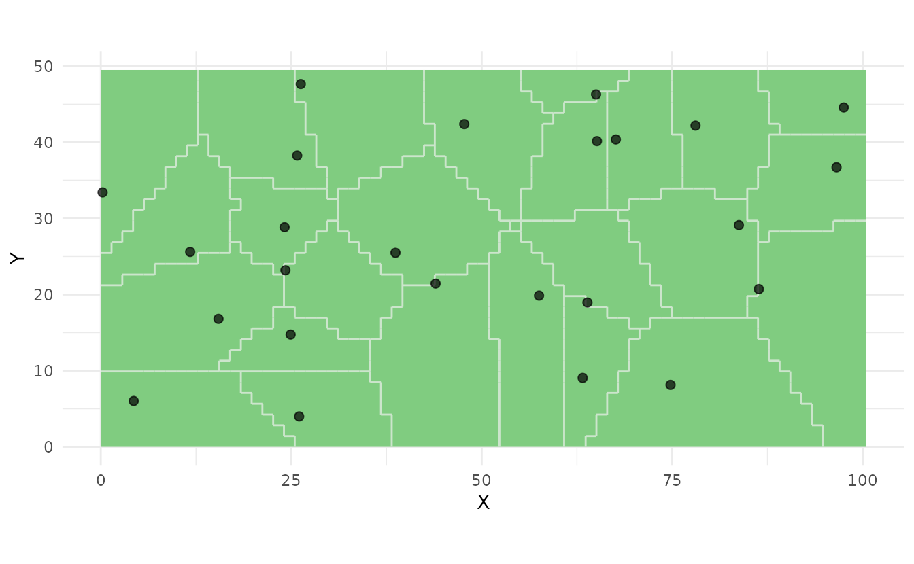

``` r

# 4. Get information
print(paste("Number of strata:", ss_n_strata(strata)))
#> [1] "Number of strata: 25"
print(paste("Number of samples:", ss_n_samples(samples)))
#> [1] "Number of samples: 25"

# 5. Check stratum areas
areas <- ss_area(strata)
print(paste("Area range:", round(min(areas), 2), "-", round(max(areas), 2)))
#> [1] "Area range: 54 - 386"
```

------------------------------------------------------------------------

### 6.3 Workflow 3: Spatial Coverage Sampling

``` r
# 1. All-in-one approach
set.seed(456)
samples <- ss_coverage(study_area, n_strata = 30, n_try = 10)

# 2. Visualize
plot(samples)
```

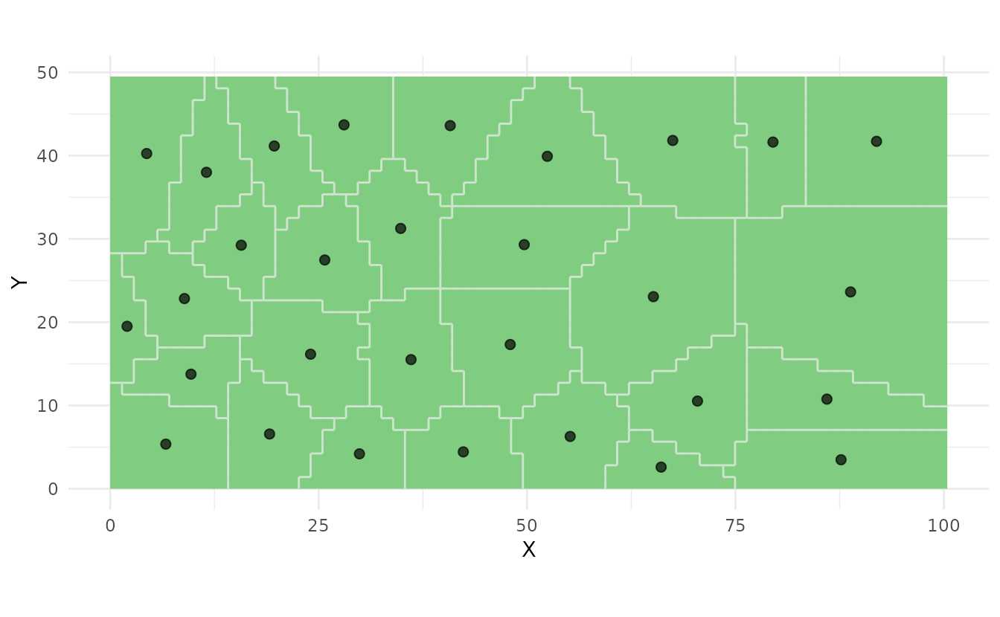

``` r

# 3. Get summary statistics
summary_info <- ss_summary(samples)
print(summary_info)
#>     method n_samples    x_min    x_max    y_min   y_max n_strata     mssd
#> 1 coverage        30 2.016564 91.92388 2.606194 43.6992       30 35.63954
#>   equal_area
#> 1      FALSE

# 4. Export as sf object
samples_sf <- ss_to_sf(samples)

# Write to file (example)
# st_write(samples_sf, "samples.gpkg")
```

------------------------------------------------------------------------

### 6.4 Workflow 4: Maxvol Optimal Design

``` r
# 1. Create grid with features
strata <- ss_stratify(study_area, n_strata = 100, n_try = 5)
cells <- strata$cells

# 2. Add terrain features
coords <- st_coordinates(cells)
cells$elevation <- coords[,2] + rnorm(nrow(coords), 0, 5)
cells$slope <- abs(rnorm(nrow(coords), 5, 2))
cells$aspect <- runif(nrow(coords), 0, 360)
cells$twi <- rnorm(nrow(coords), 8, 1.5)

# 3. Select optimal samples
set.seed(789)
samples <- ss_maxvol(
  cells,
  n = 25,
  features = c("elevation", "slope", "aspect", "twi"),
  min_dist = 5,
  normalize = TRUE,
  add_coords = TRUE,
  verbose = TRUE
)
#> Added coordinates as features
#> Normalized features
#> Running maxvol algorithm...
#> Maxvol converged in 1 iterations

# 4. Check convergence
print(paste("Converged:", samples$converged))
#> [1] "Converged: TRUE"
print(paste("Iterations:", samples$iterations))
#> [1] "Iterations: 1"

# 5. Visualize
ss_plot_samples(samples)
```

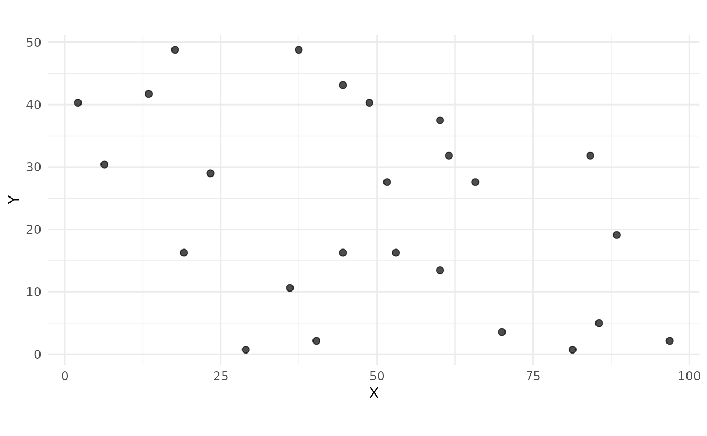

``` r

# 6. Get maxvol summary
summary_maxvol <- ss_summary.maxvol(samples)
#> Maxvol Optimal Design Sampling - Summary
#> =========================================
#> 
#> Samples:
#>   Total samples: 25 
#>   X range: 2.12 - 96.87 
#>   Y range: 0.71 - 48.79 
#> 
#> Maxvol Algorithm:
#>   Features used: 6 
#>   Feature names: elevation, slope, aspect, twi, X, Y 
#>   Converged: TRUE 
#>   Iterations: 1
print(summary_maxvol)
#> NA 
#> NA 
#> Number of samples: 25
```

------------------------------------------------------------------------

### 6.5 Workflow 5: Composite Sampling

``` r
# 1. Create composite samples
set.seed(111)
samples <- ss_composite(
  study_area,
  n_strata = 30,
  n_composites = 4,
  n_try = 10
)

# 2. Visualize (different symbols per composite)
ss_plot_samples(samples)
```

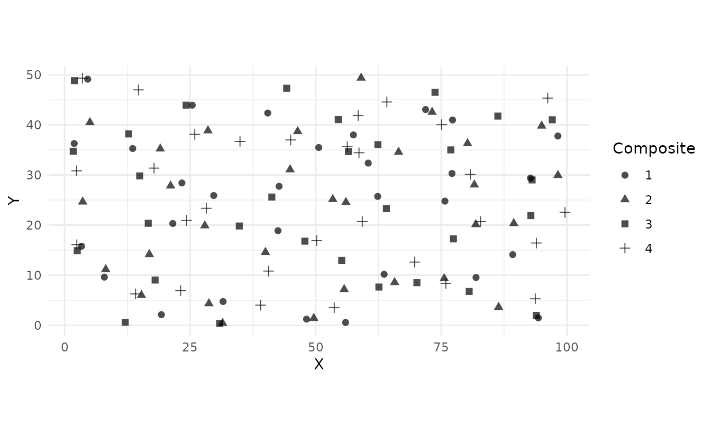

``` r

# 3. Get composite assignments
samples_sf <- ss_to_sf(samples)
table(samples_sf$composite_id)
#> < table of extent 0 >

# 4. Export by composite
coords <- ss_to_data_frame(samples)
head(coords)
#>   stratum_id sample_id composite        X        Y
#> 1          1         1         1 40.45178 42.36465
#> 2          1         2         2 46.41346 38.69992
#> 3          1         3         3 44.22392 47.31324
#> 4          1         4         4 45.01655 36.99218
#> 5          2         5         1 42.49344 18.87764
#> 6          2         6         2 39.99177 14.58974
```

------------------------------------------------------------------------

### 6.6 Workflow 6: Working with Prior Points

``` r
# 1. Define existing sample locations
prior_points <- st_as_sf(
  data.frame(x = c(20, 80), y = c(15, 35)),
  coords = c("x", "y")
)

# 2. Create stratification around prior points
strata <- ss_stratify(
  study_area,
  n_strata = 23,  # Total will be 25 with 2 prior points
  prior_points = prior_points,
  n_try = 5
)

# 3. Sample at centroids
samples <- ss_coverage(strata)

# 4. Visualize (prior points shown differently)
ss_plot(strata, samples = samples)
```

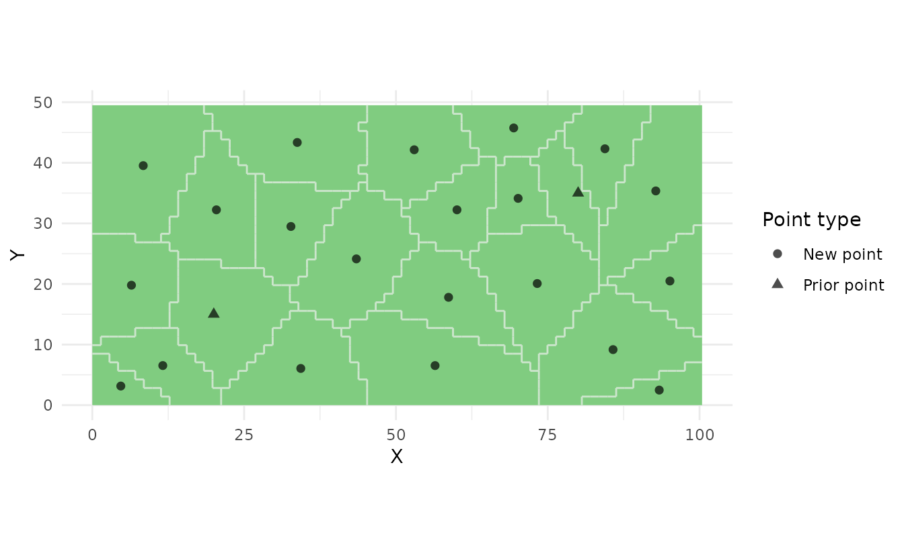

``` r

# 5. Check which are prior points
samples_sf <- ss_to_sf(samples)
table(samples_sf$is_prior)
#> 
#> FALSE  TRUE 
#>    21     2
```

------------------------------------------------------------------------

## 7. Exporting Results

### 7.1 Export to CSV

``` r
# Get coordinates as data frame
samples <- ss_coverage(study_area, n_strata = 25, n_try = 5)
coords <- ss_to_data_frame(samples)

# Write to CSV
write.csv(coords, "sampling_points.csv", row.names = FALSE)
```

------------------------------------------------------------------------

### 7.2 Export to Shapefile

``` r
# Convert to sf object
samples_sf <- ss_to_sf(samples)

# Write shapefile
st_write(samples_sf, "sampling_points.shp")
```

------------------------------------------------------------------------

### 7.3 Export to GeoPackage

``` r
# Write GeoPackage
st_write(samples_sf, "sampling_points.gpkg")
```

------------------------------------------------------------------------

### 7.4 Export to GeoJSON

``` r
# Write GeoJSON
st_write(samples_sf, "sampling_points.geojson")
```

------------------------------------------------------------------------

## 8. Comparison of Methods

### 8.1 Visual Comparison

``` r
# Set seed for consistency
set.seed(999)

# Random sampling
samples_random <- ss_random(study_area, n = 20)

# Stratified sampling
strata <- ss_stratify(study_area, n_strata = 20, n_try = 5)
samples_strat <- ss_stratified(strata, n_per_stratum = 1)

# Coverage sampling
samples_cov <- ss_coverage(study_area, n_strata = 20, n_try = 5)

# Composite sampling
samples_comp <- ss_composite(study_area, n_strata = 20, n_composites = 4)

# Note: Plotting would show the differences
# In practice, use plot() or ss_plot_samples() for each
```

------------------------------------------------------------------------

### 8.2 When to Use Each Method

| Method            | Best For               | Advantages          | Disadvantages                |
|-------------------|------------------------|---------------------|------------------------------|
| `ss_random()`     | Simple designs         | Easy to implement   | May cluster                  |
| `ss_stratified()` | Design-based inference | Unbiased estimates  | Requires good stratification |
| `ss_coverage()`   | Spatial interpolation  | Good spatial spread | Not random                   |
| `ss_maxvol()`     | Feature diversity      | Optimal for kriging | Needs feature data           |
| `ss_composite()`  | Cost reduction         | Fewer lab analyses  | Less spatial detail          |

------------------------------------------------------------------------

## 9. Tips and Best Practices

### 9.1 Choosing Number of Strata

``` r
# Rule of thumb: n_strata ≈ sqrt(study area / typical mapping unit)
# For our 5000 unit² area with ~100 unit² mapping units:
n_strata_suggested <- round(sqrt(5000 / 100))
print(paste("Suggested strata:", n_strata_suggested))
#> [1] "Suggested strata: 7"
```

------------------------------------------------------------------------

### 9.2 Using Multiple Tries

``` r
# Always use n_try > 1 to avoid local optima
strata_few <- ss_stratify(study_area, n_strata = 25, n_try = 1)
strata_many <- ss_stratify(study_area, n_strata = 25, n_try = 10)

# Compare MSSD (lower is better)
print(paste("Few tries MSSD:", round(strata_few$mssd, 2)))
#> [1] "Few tries MSSD: 43.68"
print(paste("Many tries MSSD:", round(strata_many$mssd, 2)))
#> [1] "Many tries MSSD: 40.29"
```

------------------------------------------------------------------------

### 9.3 Checking Convergence

``` r
strata <- ss_stratify(study_area, n_strata = 25, n_try = 5)

# Check if algorithm converged
print(paste("Converged:", strata$converged))
#> [1] "Converged: TRUE"
print(paste("Iterations:", strata$iterations))
#> [1] "Iterations: "
print(paste("MSSD:", round(strata$mssd, 2)))
#> [1] "MSSD: 41.06"
```

------------------------------------------------------------------------

### 9.4 Reproducibility

``` r
# Always set seed for reproducible results
set.seed(42)
samples1 <- ss_random(study_area, n = 20)

set.seed(42)
samples2 <- ss_random(study_area, n = 20)

# Should be identical
coords1 <- st_coordinates(ss_to_sf(samples1))
coords2 <- st_coordinates(ss_to_sf(samples2))
identical(coords1, coords2)
#> [1] TRUE
```

------------------------------------------------------------------------

## 10. Troubleshooting

### 10.1 Study Area Issues

``` r
# Empty geometry will fail
empty_poly <- st_polygon(list(matrix(numeric(0), ncol = 2)))
#> Error in `y[1, ]`:
#> ! subscript out of bounds
# ss_stratify(st_sf(geometry = st_sfc(empty_poly)), n_strata = 10)
```

------------------------------------------------------------------------

### 10.2 Too Many Strata

``` r
# Too many strata for small area
# ss_stratify(study_area, n_strata = 10000, n_try = 5)
# Will warn about grid resolution
```

------------------------------------------------------------------------

### 10.3 Maxvol Requirements

``` r
# n must be >= number of features
feature_mat <- matrix(rnorm(500), ncol = 5)
coords_mat <- cbind(x = 1:100, y = 1:100)

# This will fail: n < n_features
# ss_maxvol(feature_mat, n = 3, coords = coords_mat)

# This will work: n >= n_features
samples <- ss_maxvol(feature_mat, n = 10, coords = coords_mat)
#> Warning: Initial submatrix is rank deficient, attempting to improve selection
#> Error:
#> ! Cannot find linearly independent initial submatrix. Features may be too correlated or insufficient.
```

------------------------------------------------------------------------

## 11. Advanced Topics

### 11.1 Custom Grid Resolution

``` r
# Higher resolution for detailed areas
strata_fine <- ss_stratify(
  study_area,
  n_strata = 25,
  n_cells = 5000,  # Default is ~2500
  n_try = 5
)

# Lower resolution for large areas
strata_coarse <- ss_stratify(
  study_area,
  n_strata = 25,
  n_cells = 1000,
  n_try = 5
)
```

------------------------------------------------------------------------

### 11.2 Working with Real Shapefiles

``` r
# Read shapefile
study_area <- st_read("path/to/study_area.shp")

# Create sampling design
set.seed(42)
samples <- ss_coverage(study_area, n_strata = 50, n_try = 10)

# Export results
coords <- ss_to_data_frame(samples)
write.csv(coords, "sampling_points.csv", row.names = FALSE)

# Or export as spatial file
samples_sf <- ss_to_sf(samples)
st_write(samples_sf, "sampling_points.gpkg")
```

------------------------------------------------------------------------

### 11.3 Integrating with Other Packages

``` r
# Use with terra for raster data
library(terra)
dem <- rast("dem.tif")

# Extract features at grid points
# ... (feature extraction code)

# Use maxvol for optimal sampling
samples <- ss_maxvol(
  feature_matrix,
  n = 50,
  coords = coordinates_matrix,
  normalize = TRUE
)
```

------------------------------------------------------------------------

## 12. Function Reference Summary

### Stratification

- `ss_stratify()` - Create compact geographical strata

### Sampling

- `ss_random()` - Simple random sampling
- `ss_stratified()` - Stratified random sampling
- `ss_coverage()` - Spatial coverage sampling
- `ss_coverage_equal_area()` - Equal-area coverage sampling
- `ss_maxvol()` - Maxvol optimal design sampling
- `ss_composite()` - Composite sampling

### Visualization

- `ss_plot()` - Plot strata and/or samples
- `ss_plot_samples()` - Plot samples only
- `plot.ss_strata()` - S3 plot method for strata
- `plot.ss_samples()` - S3 plot method for samples

### Information

- `ss_summary()` - Get summary statistics
- `ss_summary.maxvol()` - Maxvol-specific summary
- `print.ss_strata()` - Print strata
- `print.ss_samples()` - Print samples
- `summary.ss_strata()` - Summary for strata
- `summary.ss_samples()` - Summary for samples

### Utilities

- `ss_n_strata()` - Get number of strata
- `ss_n_samples()` - Get number of samples
- `ss_get_samples()` - Extract samples as sf
- `ss_to_sf()` - Convert to sf object
- `ss_to_data_frame()` - Convert to data frame
- `ss_area()` - Get stratum areas
- `ss_relative_area()` - Get relative stratum areas

------------------------------------------------------------------------

## References

- de Gruijter, J.J., Brus, D.J., Bierkens, M.F.P., and Knotters, M.
  (2006). *Sampling for Natural Resource Monitoring*. Springer, Berlin.

- Walvoort, D.J.J., Brus, D.J., and de Gruijter, J.J. (2010). An R
  package for spatial coverage sampling and random sampling from compact
  geographical strata by k-means. *Computers & Geosciences* 36,
  1261-1267.

- Petrovskaia, N., Korveh, K., and Maas, E. (2021). Optimal soil
  sampling design based on the maxvol algorithm. *Geoderma* 381, 114733.
